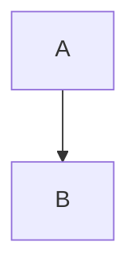
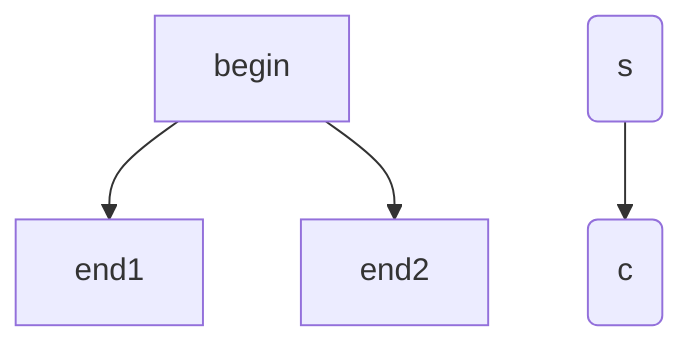

# Gray code

一次改变一位，在数字系统中稳定性高，抗干扰；

二进制码转格雷码

```VERILOG
module binary_to_gray #(
    parameter PTR = 8
) (
    binary_value,
    gray_value
);
//**********************************
input   [PTR:0] binary_value;
output  [PTR:0] gray_value;
//**********************************
wire [PTR:0]gray_value;
generate
    genvar i;
    for(i = 0;i < (PTR);i = i+1)
    begin
        assign gray_value[i] = binary_value[i] ^ binary_value[i+1];
    end
endgenerate

assign gray_value[PTR] = binary_value[PTR];
    
endmodule

```

格雷码转二进制码

```VERILOG
module gray_to_binary #(
    parameter PTR = 8
) (
    gray_value,
    binary_value
);
//***************************
input   [PTR:0] gray_value;
output  [PTR:0] binary_value;
//***************************
wire    [PTR:0] binary_value;

assign binary_value[PTR] = gray_value[PTR];

generate
    genvar i;
    for(i=1;i<(PTR);i=i+1)
    begin
        assign binary_value[i] = gray_value[i+1] ^ gray_value[i];
    end
endgenerate

endmodule
```







```flow
```

